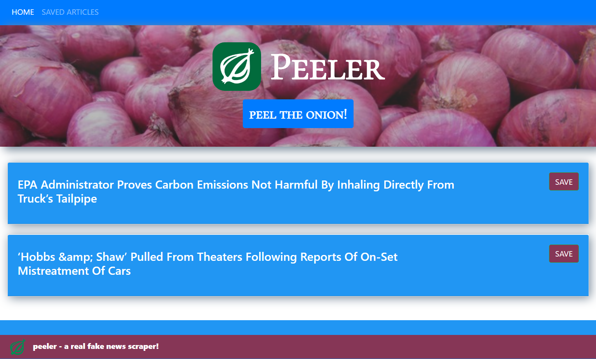

# mongo-article-scraper
Why worry about real news when you can have real fake news? This full-stack CRUD app scrapes the Onion for links to headlines, displays them to the user, and allows the user to save them for later and comment on them.

# tech
MongoDB, Mongoose, Node, Express, Cheerio, Bootstrap

# try it yourself! 
https://onionpeeler.onrender.com/

